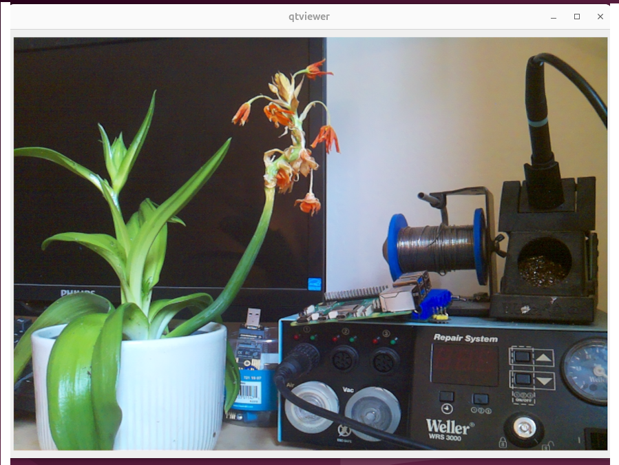

# libcamera to openCV library

This is a wrapper around libcamera which hides all its complexity and
makes it as easy as possible to establish a callback delivering openCV
frames.

The motivation behind this wrapper is that the raw callback interface
of libcamera forces the user to understand complex memory mapping and 
conventions buried deep in its source code to achieve the
conversion to RGB. This library is an attempt to abstract all
this complexity away and provide a friendly callback which directly
delivers openCV images.

Works with:
 - Raspberry PI CSI cameras
 - Webcams delivering MJPEG

## Prerequisites

```
apt install libopencv-dev libcamera-dev libjpeg-turbo8-dev libturbojpeg0-dev
```

## Compilation and installation

```
cmake .
make
sudo make install
```

## How to use it

 1. Include `libcam2opencv.h` and add `target_link_libraries(yourproj cam2opencv)` to your `CMakeLists.txt`.

 2. Create a class containing this callback:
```
    struct MyCallback {
        virtual void onFrame(const cv::Mat &frame) {
                window->updateImage(frame);
        }
    };
```

 3. Create instances of the camera and the callback:

```
Libcam2OpenCV camera;
MyCallback myCallback;
```

 4. Register the callback

```
   camera.registerCallback([&](const cv::Mat &mat, const libcamera::ControlList &meta){ myCallback.onFrame(mat); });
```

 5. Start the camera delivering frames via the callback

```
camera.start();
```

 6. Stop the camera

```
camera.stop();
```

## Examples

### Metadata printer

In the subdirectory `metadataprinter` is a demo which just prints the sensor
metadata from the callback. This is useful to see what
info is available for example the sensor timestamp to
check the framerate.

### QT Image Viewer

The subdirectory `qtviewer` contains a simple QT application which displays the camera on screen.



## Credits

Based on https://github.com/kbingham/simple-cam, libcamera's qcam and then turned into this library by Bernd Porr. Additional features by Raphael Nekam.
