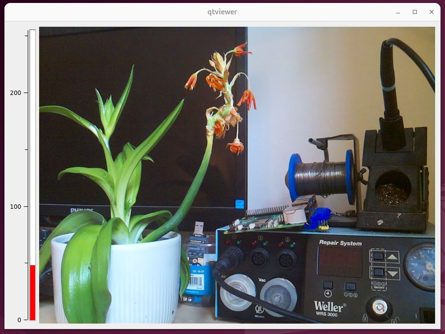

# Raspberry PI libcamera to openCV library with callback

This is a wrapper around libcamera which makes it a lot easier to establish
a callback containing an openCV matrix.

## Prerequisites

```
apt install libopencv-dev libcamera-dev
```

## Compilation and installation

```
cmake .
make
sudo make install
```

## How to use it

 1. Include `libcam2opencv.h` and add `target_link_libraries(yourproj cam2opencv)` to your `CMakeLists.txt`.

 2. Create your custom callback
```
    struct MyCallback : Libcam2OpenCV::Callback {
        virtual void hasFrame(const cv::Mat &frame, const libcamera:ControlList &) {
            if (nullptr != window) {
                window->updateImage(frame);
            }
        }
    };
```

 3. Create instances of the the camera and the callback:

```
Libcam2OpenCV camera;
MyCallback myCallback;
```

 4. Register the callback

```
camera.registerCallback(&myCallback);
```

 5. Start the camera delivering frames via the callback

```
camera.start();
```

 6. Stop the camera

```
camera.stop();
```

## Examples

### Metadata printer

In the subdirectory `metadataprinter` is a demo which just prints the sensor
metadata from the callback. This is useful to see what
info is available for example the sensor timestamp to
check the framerate.

### QT Image Viewer

The subdirectory `qtviewer` contains a simple QT application
which displays the camera on screen and the value of one pixel
as a thermometer with QWT.



## Credits

Based on https://github.com/kbingham/simple-cam and then turned into this library by Bernd Porr.
Additional features by Raphael Nekam.
